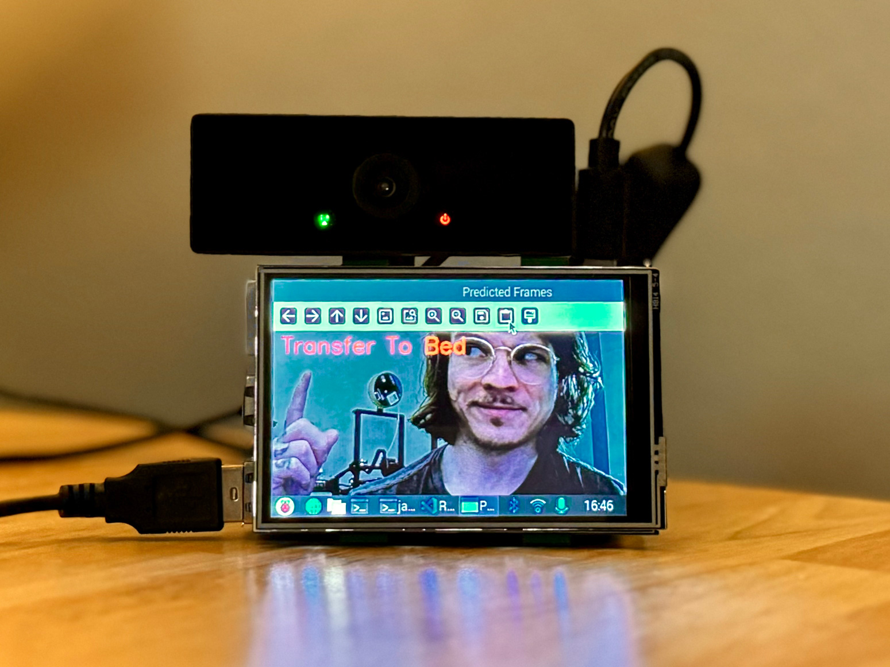

# Patient Activity Monitoring  
This repo features our initial work using OpenCV, TensorFlow, and PyTorch to train three convolutional neural networks (CNNs) for human activity recognition. These files include modifications of the base [Conv2D](https://www.tensorflow.org/api_docs/python/tf/keras/layers/Conv2D) code provided by the [Introduction to Video Classification & Human Activity Recognition](https://learnopencv.com/introduction-to-video-classification-and-human-activity-recognition/) tutorial, modifications to a pretrained [S3D](https://pytorch.org/vision/main/models/generated/torchvision.models.video.s3d.html#torchvision.models.video.s3d) model, and a [Conv3D](https://www.tensorflow.org/api_docs/python/tf/keras/layers/Conv3D) model built from scratch by [@nehabaddam](https://github.com/nehabaddam). 

<br />

## Setup instructions

**1. Create a virtual environment**  
It is recommended to create a new virtual environment for this project. Use `venv` or `conda` to create a virtual environment and install the dependencies. If using a Mac, [jump to this section](#apple-silicon). 

**2. Install dependencies from `requirements.txt` (optional)**

```console
pip install -r requirements.txt
```

<br />

<a id="apple-silicon"></a>


## Setup instructions: Apple Silicon
The `tensorflow-metal` plugin will enable the GPU on Macs fitted with [Apple silicon](https://support.apple.com/en-us/116943) or AMD procesors, which radically improves model training time. More info is available [here](https://pypi.org/project/tensorflow-metal/). 

**1. Deactivate current venv / conda environments**

```console
# venv
deactivate

# conda
conda deactivate
```

<br />

**2. Create new venv**
```console
python3 -m venv ~/venv-metal  
```  

<br />

**3. Activate `venv-metal`**
```console
source ~/venv-metal/bin/activate  
```  

<br />

**4. Install `tensorflow-metal`**

```console
python -m pip install -U pip  
python -m pip install tensorflow-metal
```

<br />

**5. Install TensorFlow and OpenCV**
```
python -m pip install tensorflow
pip3 install opencv-python
```

<br />

<a id="file-structure"></a>

## File structure
Videos used for this project are not included here due to storage and PII reasons, so these files will need to be added manually. If you are a contributor to this project, contact [@jamescoledesign](https://github.com/jamescoledesign) for access to the dataset.  

After you download the dataset, create a folder named `downloads` at the root of your local clone of this repo and place the `train` and `test` folders within the `downloads` folder like the example below.

```
root
└───downloads  
│   └───test
│   │   └─feature
│   │     │   video1.mp4
│   │     │   video2.mp4
│   │     │   ...
│   │
│   └───train
│   │   └─feature
│   │     │   video3.mp4
│   │     │   video4.mp4
│   │     │   ...
```

<br />

## Training 
Ensure the videos organized in the format described in the [_File structure_](#file-structure) section above. 

### Train Conv2D

```console
python conv2d_train.py
```

### Train Conv3D 

```console
python conv3d_train.py
```

### Train S3D

Navigate to `/notebooks/pre_trained.jpynb` and run the code in the Jupyter Notebook. 

<br />

## Testing 

### Test Conv2D 
Ensure the videos organized in the format described in the [_File structure_](#file-structure) section, then run the command below and follow the prompts. 

```console
python conv2d_train.py
```

### Test Conv3d 
This model is too large to store on GitHub, but you can download the model [here](https://drive.google.com/file/d/11Uh4Fwc-7eWNWMYk5FLqjpHCURRmY8zM/view?usp=drive_link) and place it in `./conv3D/2024-09-22-13-18-18-conv3d-model.keras`.

Next, ensure the videos organized in the format described in the [_File structure_](#file-structure) section, run the command below, and follow the prompts. 

```console
python conv3d_test.py 
```

### Test S3D 
Ensure the videos organized in the format described in the [_File structure_](#file-structure) section. Navigate to `/notebooks/pre_trained.ipynb` and run the code in the Jupyter Notebook.


## Demo
The demo can be run from the root directory using `python demo.py` and following the prompts. Predictions can be made using either prerecorded video or live webcam video.

### Example output using prerecorded video: 

```
Predictions for each class:
 
+------------------------+---------------+
| Prediction             |   Probability |
+========================+===============+
| Sitting In Wheelchair  |          0.81 |
| Eating                 |          0.19 |
| Watching TV            |          0    |
| Asleep Trying to sleep |          0    |
| Lying In Bed           |          0    |
| Therapy                |          0    |
| Transfer To Bed        |          0    |
| Family                 |          0    |
| Nurse Visit            |          0    |
| Talking on the Phone   |          0    |
| EVS Visit              |          0    |
| Doctor Visit           |          0    |
+------------------------+---------------+
```

### Example output using live video: 
Predicting live video from a webcam attached to a Raspberry Pi 5



<br />


## Troubleshooting
The file `pre_trained.ipynb` uses OpenCV features with dependencies that may not be automatically installed (e.g., GStreamer). To clear errors, OpenCV may need to be built from source. A few options are below.

### Solution 1

[Example from  OpenCV docs](https://docs.opencv.org/4.x/d7/d9f/tutorial_linux_install.html#tutorial_linux_install_quick_build_contrib)

```
# Install minimal prerequisites (Ubuntu 18.04 as reference)
sudo apt update && sudo apt install -y cmake g++ wget unzip
 
# Download and unpack sources
wget -O opencv.zip https://github.com/opencv/opencv/archive/4.x.zip
wget -O opencv_contrib.zip https://github.com/opencv/opencv_contrib/archive/4.x.zip
unzip opencv.zip
unzip opencv_contrib.zip
 
# Create build directory and switch into it
mkdir -p build && cd build
 
# Configure
cmake -DOPENCV_EXTRA_MODULES_PATH=../opencv_contrib-4.x/modules ../opencv-4.x
 
# Build
cmake --build .

```

### Solution 2

[Example from this forum post](https://discuss.bluerobotics.com/t/opencv-python-with-gstreamer-backend/8842)

```
git clone --recursive https://github.com/skvark/opencv-python.git
cd opencv-python
export CMAKE_ARGS="-DWITH_GSTREAMER=ON"
pip install --upgrade pip wheel
# this is the build step - the repo estimates it can take from 5 
#   mins to > 2 hrs depending on your computer hardware
pip wheel . --verbose
pip install opencv_python*.whl
```

<br />


## References
- [Introduction to Video Classification & Human Activity Recognition](https://learnopencv.com/introduction-to-video-classification-and-human-activity-recognition/)
- [Conv2D](https://www.tensorflow.org/api_docs/python/tf/keras/layers/Conv2D)
- [Conv3D](https://www.tensorflow.org/api_docs/python/tf/keras/layers/Conv3D)
- [S3D](https://pytorch.org/vision/main/models/generated/torchvision.models.video.s3d.html#torchvision.models.video.s3d)
- [Apple silicon](https://support.apple.com/en-us/116943)
- [tensorflow-metal](https://pypi.org/project/tensorflow-metal/)